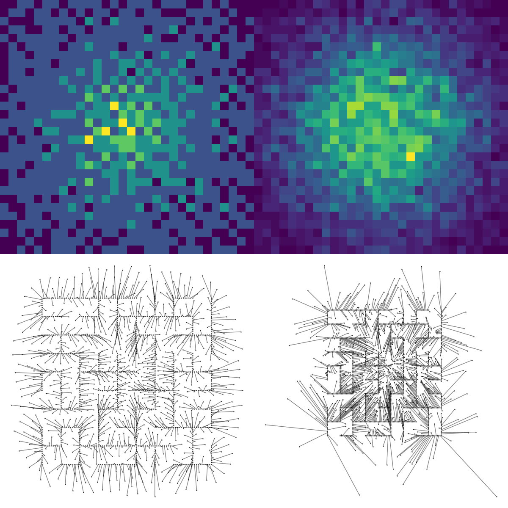

# Energy Flows

I was thinking about optimal transport in the light of all the flow matching work and
thinking it would be nice to avoid those expensive solvers. What if we could use an
energy function which is minimised by a known density we can sample from. We can compute
the gradient of the energy and take steps in the negative direction to minimise it. We
can consider the start and end points of this trajectory as an assignment of data points
to simple data distribution points. This assignment should roughly be the same as the
optimal transport- but we have repelled the simple distribution samples which means each
data point is spread out by an even amount which is of course nothing like real samples
from this simple data distribution.

`gaussian_energy_v1.py` gives a smooth animation but doesn't satisfy the Gaussian
losses well.
`gaussian_energy_v2.py` gives a jerky animation but does satisfy the Gaussian
losses well. 

