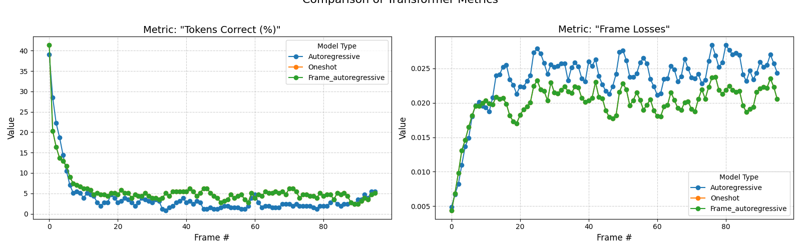

# Molecular Dynamics with a Transformer

This system encodes a simple 2D box of particles which move at a constant velocity but
bounce off the walls using a vector-quantised variational auto-encoder. Then, using
these tokens predicts the tokens of each frame one by one. Also another transformer
which cross attends to the patches and directly predicts the tokens for all the patches
in the next frame.

The performance visually looks ok, but it hasn't fully learnt the physics, I will come
back to this as I think it can be done and I didn't push the model size / training steps
/ kernels far.

To run you can just copy this on a folder on colab and change the path that it mounts
to. Dynamics.ipynb is the entrypoint.

